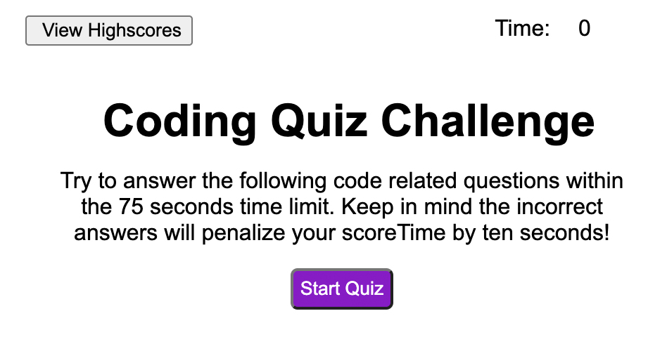

# code-quiz
Timed coding quiz with multiple choice questions

UCLA Bootcamp Challenge 4 - Module 4

Due Date 9/12/2022

## Challenge Tasks
---

Create application that generates a timed quiz on JavaScript fundamentals that stores high scores
- Be able to gauge progress compared to others

Final application to resemble the following mock-up:

## Requirements
---

1- Click on start button to start taking quiz (see following image)

2- timer starts and a question and 4 multiple choice answers.
3- once question is answered, you are presented with a new question and whether your answer to the last question was correct or wrong dispayed on the bottom.
4- If question is answered correctly
- Prompt to confirm whether or not to include lowercase, uppercase, numeric and special characters.
- Validate answers to the prompt to assure inclusion of at least one character type.
- Password generated that matches the selected criteria
- Password is generated and displayed on the page or displayed in an alert
- Repository be clean, easy to navigate and follow logical structure
- Accessible alt attributes for all images
- Follow best practice for file structure, naming indentations and comments
- Create GitHub repository with multilpe commits and descriptive messages
- README file with screenshots and link to final deployed applicaton and GitHub repository
- Deploy application with no errors while loading

## Final Submission
---
1. Code Quiz application is deployed and can be seen at: [Code Quiz](https://me-ross.github.io/code-quiz/)

2. Repository for Code Quiz application can be found at: [GitHub](https://github.com/Me-ross/code-quiz/)

