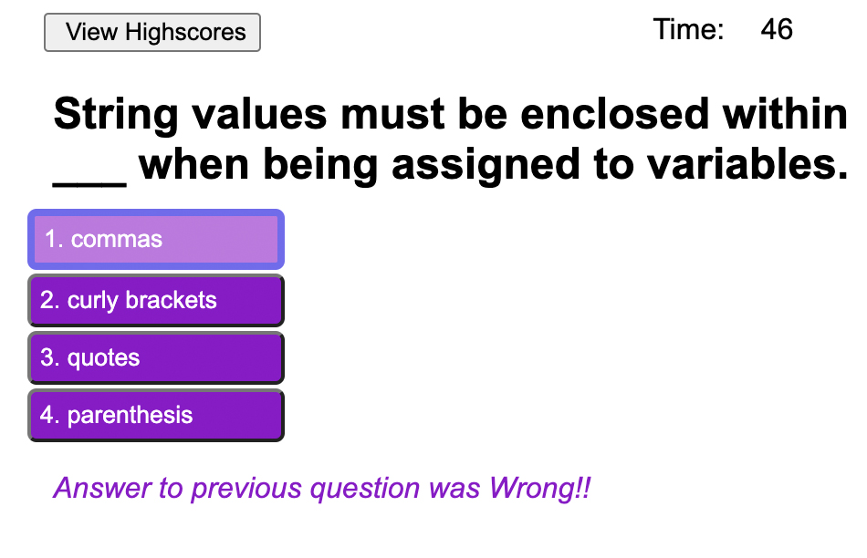
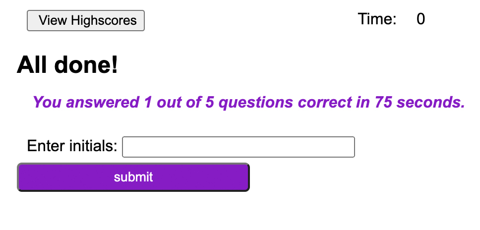

# code-quiz
Timed coding quiz with multiple choice questions

UCLA Bootcamp Challenge 4 - Module 4

Due Date 9/12/2022

## Challenge Tasks
---

Create application that generates a timed quiz on JavaScript fundamentals that stores high scores
- Be able to gauge progress compared to others

Final application to resemble the following mock-up:

## Requirements
---

- Click on start button to start taking quiz (see following image)

- timer starts and a question and 4 multiple choice answers.
- There are a total of 5 questions.
- If question is answered correctly, you are presented with a new question and hether your answer to the last question was correct or wrong dispayed on the bottom.
- If question is answered incorrectlty then 10 seconds is removed from your time and a new questions is presented (see following image)

- once all questions are answered then the quiz stops
- Or quiz stops once time runs out
- you are presented with the results of your quiz
- Asked to input initials along with your time score (see following image)

- initials and time are stored as part of highscore
- button to go back and retake the test
- Button to clear all history of scores (see following image)

![Text page with results of test and request for initials input button]

## Final Submission
---
1. Code Quiz application is deployed and can be seen at: [Code Quiz](https://me-ross.github.io/code-quiz/)

2. Repository for Code Quiz application can be found at: [GitHub](https://github.com/Me-ross/code-quiz/)

